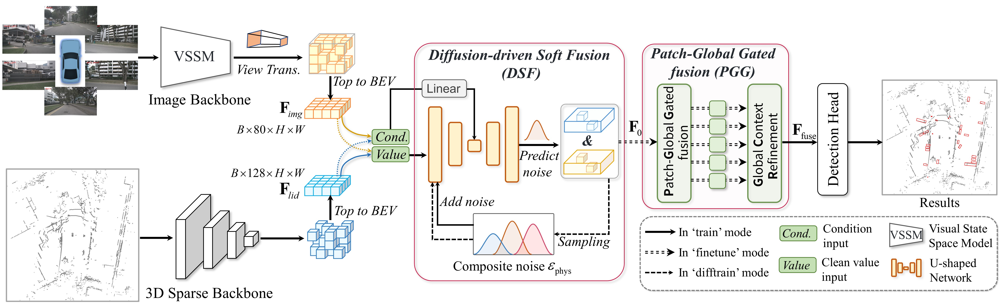

<div align="center">
  <h1>CoDIF: Conditional Diffusion Fusion with Soft Alignment <br> for Robust Multimodal 3D Object Detection</h1>

  <p>
    <a href="mailto:202311050810@std.uestc.edu.cn">Pan Gao</a><sup>1</sup>,
    <a href="mailto:freecjm2003@scpolicec.edu.cn">Jianmei Cheng</a><sup>2†</sup>,
    <a href="mailto:chfei@uestc.edu.cn">Chun Fei</a><sup>3</sup>,
    <a href="mailto:renshuai@uestc.edu.cn">Shuai Ren</a><sup>1</sup>,
    <a href="mailto:202421050526@std.uestc.edu.cn">Yuling Fan</a><sup>1</sup>,
    <a href="mailto:pingzh@uestc.edu.cn">Ping Zhang</a><sup>1,4,5†</sup>
  </p>
  <p>
    <sup>1</sup>School of Optoelectronic Science and Engineering, University of Electronic Science and Technology of China<br/>
    <sup>2</sup>Intelligent Policing Key Laboratory of Sichuan Province, Sichuan Police College<br/>
    <sup>3</sup>Industrial Technology Research Institute, University of Electronic Science and Technology of China<br/>
    <sup>4</sup>Shenzhen Institute for Advanced Study, University of Electronic Science and Technology of China<br/>
    <sup>5</sup>Yibin Institute, University of Electronic Science and Technology of China
  </p>
  <p>
    <sup>†</sup>Corresponding author.
  </p>
</div>

## Abstract

We present CoDIF, a multimodal 3D object detection framework that replaces rigid calibration-based alignment with a **soft alignment** mechanism via conditional diffusion fusion. 


## Overview



---

## 🔥 News

- **[2026.06]** Code of CoDIF is released.

---

## Installation

If you encounter any problems, please consult the [install.md](docs/install.md) file for the exact version requirements of each package. If the issue still isn’t resolved, feel free to open an issue.

```bash
conda create -n codif python=3.8

# You can install CUDA 11.8 (if it isn’t already on your system) by running:
# conda install --channel "nvidia/label/cuda-11.8.0" cuda
pip install torch==2.1.0 torchvision==0.16.0 torchaudio==2.1.0 --index-url https://download.pytorch.org/whl/cu118

# Install extra dependency
pip install -r requirements.txt

# Install nuscenes-devkit
pip install nuscenes-devkit==1.0.5 torchinfo

# Develop
python setup.py develop

cd selective_scan
python setup.py develop

cd mamba_diffv/mamba
python setup.py develop

python -m pip install causal-conv1d==1.2.0.post2
```

## Dataset Preparation

- Please download the official [NuScenes 3D object detection dataset](https://www.nuscenes.org/download) and organize the downloaded files as follows:

```
OpenPCDet
├── data
│   ├── nuscenes
│   │   │── v1.0-trainval (or v1.0-mini if you use mini)
│   │   │   │── samples
│   │   │   │── sweeps
│   │   │   │── maps
│   │   │   │── v1.0-trainval
├── pcdet
├── tools
```

Generate the data infos by running the following command:

```bash
python -m pcdet.datasets.nuscenes.nuscenes_dataset --func create_nuscenes_infos \
    --cfg_file tools/cfgs/dataset_configs/nuscenes_dataset.yaml \
    --version v1.0-trainval \
    --with_cam \
    --with_cam_gt \
    # --share_memory  # if using shared memory for LiDAR and image GT sampling (~24G+143G or 12G+72G)
# Shared memory greatly improves training speed but needs ~150G or ~75G extra cache memory.
# NOTE: All experiments used shared memory. Shared memory does NOT affect performance.
```

- The format of the generated data is as follows:

```
OpenPCDet
├── data
│   ├── nuscenes
│   │   │── v1.0-trainval (or v1.0-mini if you use mini)
│   │   │   │── samples
│   │   │   │── sweeps
│   │   │   │── maps
│   │   │   │── v1.0-trainval
│   │   │   │── img_gt_database_10sweeps_withvelo
│   │   │   │── gt_database_10sweeps_withvelo
│   │   │   │── nuscenes_10sweeps_withvelo_lidar.npy (optional)
│   │   │   │── nuscenes_10sweeps_withvelo_img.npy (optional)
│   │   │   │── nuscenes_infos_10sweeps_train.pkl
│   │   │   │── nuscenes_infos_10sweeps_val.pkl
│   │   │   │── nuscenes_dbinfos_10sweeps_withvelo.pkl
├── pcdet
├── tools
```

---

## 🏆 Main Results

### nuScenes Validation Set

Comparison with state-of-the-art methods on the nuScenes validation set. FPS measured on a single RTX 3090.


| Method | Reference | Resolution | NDS | mAP | Params (M) | FPS |
|--------|-----------|-----------|:---:|:---:|:----------:|:---:|
| IS-Fusion | CVPR’24 | 1056×384 | 73.6 | 72.5 | 48.3 | 3.20 |
| MambaFusion-Base | ICCV’25 | 704×256 | 75.0 | 72.7 | — | 4.7 |
| **CoDIF-Light (Ours)** | — | 704×256 | **73.5** | **70.7** | **18.2** | **4.18** |
| **CoDIF (Ours)** | — | 704×256 | **75.4** | **73.3** | **35.5** | **3.06** |

### KITTI Validation & Test Sets

| Dataset | Modality | mAP₃ᴰ (R40) | Easy | Moderate | Hard |
|---------|:--------:|:----------:|:----:|:--------:|:----:|
| KITTI Test | L+C | **86.12** | 92.25 | 85.47 | 80.65 |
| KITTI Val | L+C | **91.09** | 96.24 | 89.85 | 87.19 |

### nuScenes-C Robustness Benchmark

CoDIF significantly outperforms baselines under sensor perturbations (misalignment, weather degradation, density reduction), demonstrating that soft alignment provides meaningful robustness gains where hard-alignment methods degrade substantially.

### Training Modes

The framework supports three operational modes controlled by `MODEL.FUSER.TRAIN_MODE`:

- **`train`**: Standard detection training with convolutional fusion only (diffusion disabled).
- **`difftrain`**: Diffusion pre-training with physically guided noise to learn the UNet-based cross-modal denoising.
- **`finetune`**: Joint end-to-end fine-tuning combining detection supervision with light diffusion regularization.

---

## Training

### Stage 1 — Detection Backbone Training

Start by downloading the [pretrained weights](https://drive.google.com/drive/folders/1TqvpIHA7plzoFdnGWvFgVYr45bgz-nQ3?usp=sharing).

```bash
cd tools
bash scripts/dist_train.sh 3 --cfg_file cfgs/nuscenes_models/Codiff.yaml --sync_bn --pretrained_model ckpts/pretrained.pth --logger_iter_interval 100
```

### Stage 2 — Diffusion Model Training

```bash
cd tools
python -m torch.distributed.launch --nproc_per_node=4 --master_port 25530 train_diffv1.py \
    --num_epochs 1000 --batch_size 1 --save_every 10 --lr 1e-3 \
    --save_dir ../output/DIff_checkpoints_physical
```

### Stage 3 — Finetune

```bash
cd tools
bash scripts/dist_train.sh 3 --cfg_file cfgs/nuscenes_models/Codiff_finetune.yaml --sync_bn --pretrained_model ckpts/pretrained.pth --logger_iter_interval 500
```

### Lightweight Variant

For the lightweight variant (CoDIF-Light), replace the config files with the `_light` versions:

```bash
cd tools
bash scripts/dist_train.sh 3 --cfg_file cfgs/nuscenes_models/Codiff_light.yaml --sync_bn --pretrained_model ckpts/pretrained.pth
```

---

## Inference

```bash
cd tools
bash scripts/dist_test.sh 3 --cfg_file cfgs/nuscenes_models/Codiff_test.yaml --ckpt path/to/checkpoint.pth
```

---

## ✨ Citation

If you find this work useful, please consider citing:

```bibtex
@article{gao2025codif,
  title={CoDIF: Conditional Diffusion Fusion with Soft Alignment for Robust Multimodal 3D Object Detection},
  author={Gao, Pan and Cheng, Jianmei and Fei, Chun and Ren, Shuai and Fan, Yuling and Zhang, Ping},
  journal={},
  year={2026}
}
```

---

## Acknowledgments

CoDIF uses code from several open source repositories. We gratefully acknowledge these contributions:

- [OpenPCDet](https://github.com/open-mmlab/OpenPCDet)
- [BEVFusion](https://github.com/mit-han-lab/bevfusion)
- [MambaFusion](https://github.com/AutoLab-SAI-SJTU/MambaFusion)
- [VMamba](https://github.com/MzeroMiko/VMamba)
- [VoxelMamba](https://github.com/gwenzhang/Voxel-Mamba)
- [LION](https://github.com/happinesslz/LION)
- [UniTR](https://github.com/Haiyang-W/UniTR)

